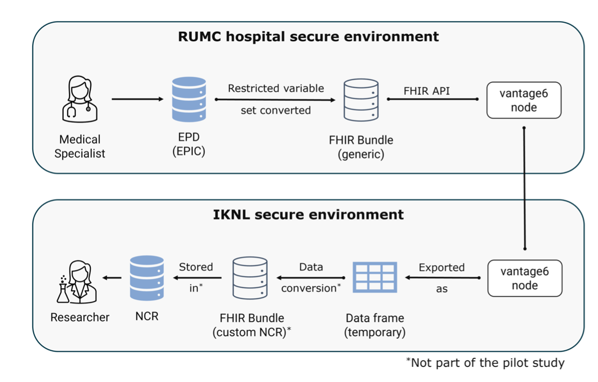

# Runtime View {#sec-runtime-view}

## Data beschikbaar maken

```{=html}
<likec4-view
   view-id="data-aanlevering"
   dynamic-variant="sequence">
</likec4-view>
```

Voor het klaarzetten en aanleveren van data bij het datastation wordt data geëxtraheerd uit het bronsysteem (EPD) van de datahouder. Dit kan via een FHIR API (zoals bij Epic), via queries (zoals bij HiX van ChipSoft), of via een andere connector. Optioneel vindt er een pseudonimisatie slag plaats voordat de data het datastation bereikt. PLUGIN-Lake ontvangt de data via een API, extractie (pull), of via een lokale volume mount. Vervolgens is de data beschikbaar voor gebruik door vantage6 algoritme containers of PLUGIN-Analytics.

## Gefedereerd leren

```{=html}
<likec4-view
   view-id="federated-learning"
   dynamic-variant="sequence">
</likec4-view>
```

Voor gefedereerd leren maakt PLUGIN gebruik van vantage6. Het gefedereerd leren van een algoritme omvat een reeks gecoördineerde stappen tussen de data gebruiker, de centrale server en de datastations. Dit proces is ontworpen om de analyse uit te voeren zonder dat de brongegevens de lokale omgeving van het datastation verlaten. Hieronder volgt een detailleerde beschrijving wat elk van de applicatiecomponenten hierin doen.

::: {.list-table}
- - stap
  - omschrijving

- - **1. Authenticatie**
  - De data gebruiker start het proces via de PLUGIN-ML client. De PLUGIN-ML client authenticeert namens de data gebruiker bij de vantage6 server.

- - **2. Taak specificatie**
  - Na succesvolle authenticatie definieert de data gebruiker via de PLUGIN-ML client een ML pipeline taak. Hierbij wordt opgegeven:
    *   Welk algoritme gebruikt moet worden (bij PLUGIN-ML: de PLUGIN-ML vantage6 container, een Docker-image gebaseerd op de generieke vantage6 algorithm container template).
    *   Specifieke inputparameters voor de analyse.
    *   Het aantal iteraties (indien van toepassing, voor machine learning).
    *   De identiteit van de *Centrale Aggregatie Server* (CAS), de node die verantwoordelijk is voor het aggregeren van resultaten.

- - **3. Verzending naar nodes**
  - De centrale server stuurt de taak door naar de betrokken nodes. De CAS ontvangt het verzoek als eerste.

- - **4. Start hoofdalgoritme (CAS)**
  - De CAS downloadt het Docker-image, start het hoofd-algoritme en orkestreert de subtaken die door de datastations uitgevoerd moeten worden.

- - **5. Start subtaken (datastations)**
  - De datastations ontvangen hun subtaak van de centrale server, downloaden hetzelfde Docker-image en starten het lokale deel van het algoritme. De analyse wordt uitgevoerd op de lokale data.

- - **6. Verzending lokale resultaten**
  - Na elke trainingscyclus of analysestap stuurt het algoritme op het datastation de lokale resultaten (bijv. modelgewichten of statistische coëfficiënten) naar de CAS. De brongegevens verlaten het datastation niet.

- - **7. Verificatie en aggregatie**
  - De CAS verifieert de resultaten, extraheert de metadata van de resultaten en voegt de resultaten van alle datastations samen tot een geaggregeerd tussenmodel. Dit voltooit één iteratie.

- - **8. Vervolg-iteraties**
  - Voor vervolgstappen vragen de datastations de geaggregeerde resultaten van de vorige ronde op bij de CAS om hun lokale modellen verder te trainen. Deze cyclus herhaalt zich totdat het model convergeert of het gewenste aantal iteraties is bereikt.

- - **9. Afronding**
  - De CAS informeert de onderzoeker dat de taak is voltooid. De onderzoeker kan vervolgens het finale, globale model downloaden van de server. Gedurende het proces heeft niemand, ook de onderzoeker niet, toegang tot de tussenresultaten, wat de veiligheid waarborgt.
:::

## Data aanlevering

In de eerste versie van PLUGIN is voor data aanlevering gebruik gemaakt van vantage6. De _runtime_ view voor deze usecase is dus hetzelfde zoals hierboven beschreven, met dien verstande dat er geen centrale aggregatie functie wordt gebruikt. Onderstaand diagram geeft een vereenvoudige weergave van deze usecase. 

TO DO: add reference to draft paper.



## Data analytics

```{=html}
<likec4-view
   view-id="federated-analytics"
   dynamic-variant="sequence">
</likec4-view>
```

Voor federatieve analytics maakt PLUGIN gebruik van PLUGIN-Lake en PLUGIN-Analytics. De data gebruiker logt in via PLUGIN-Analytics en vraagt een analyse of data op. PLUGIN-Lake valideert de credentials via het Nuts profiel en stuurt vervolgens federatieve verzoeken naar de datastations. Elk datastation valideert de credentials van de Processing Hub via hun eigen Nuts-node. Na succesvolle validatie worden de data of query resultaten teruggestuurd naar de Processing Hub, waar PLUGIN-Lake de resultaten aggregeert en een statistische integriteitscontrole uitvoert. Het eindresultaat wordt teruggegeven aan de gebruiker via PLUGIN-Analytics.
